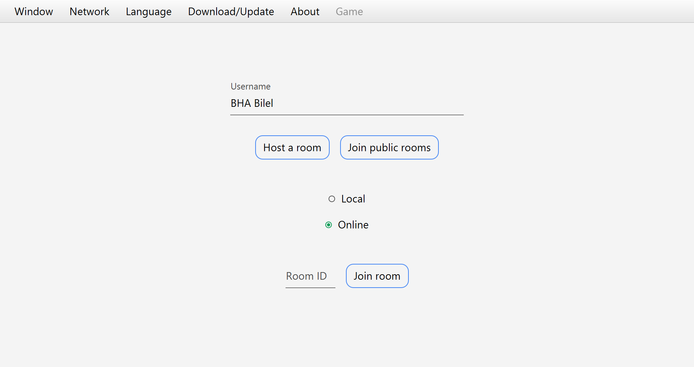
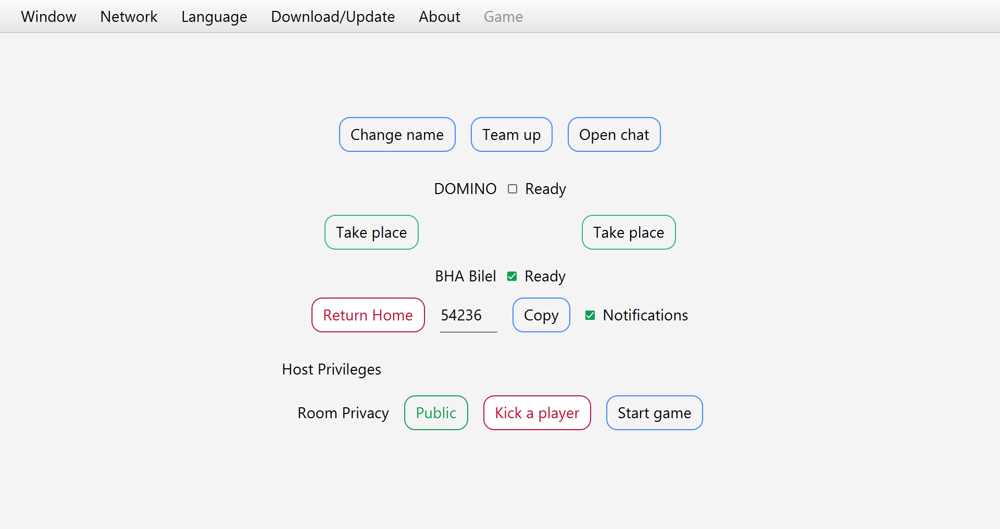
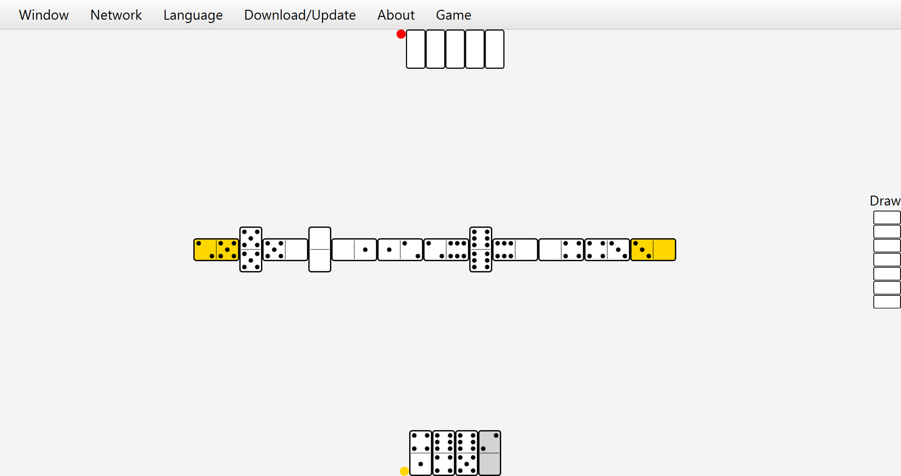

# JavaFX-DOMINOS 🕹️

> Play Dominoes with your friends online!
> 
> Jump to the [Setup](#setup) section to to download the game, enjoy!
> 
> Discover [How to play](#how-to-play) and give me your [Feedback](#feedback) on this project.
> 
> You can find 5 more board games in the [Collection](#collection) section, give them a try!

## Table of contents
* [The first challenge](#the-first-challenge)
* [Game Charachteristics](game-charachteristics)
* [How to play](#how-to-play)
* [Setup](#setup)
* [Collection](#collection)
* [Project dependencies](#project-dependencies)
* [Additional info](#additional-info)
* [Feedback](#feedback)

# The first challenge
This project is the **fifth** learning project of my collection.

Dominoes provide the challenge of connecting dynamic gui components (domino pieces) in a board, while maintaining their correct orientation, players can:
- **block** the game which leads the team with less points in their hands to win, or **tie**
- **win** the game by playing all their hand (pieces)
- **draw** extra pieces till finding a playable one
- **Pass** their turn when there are no more pieces to draw

# Game Charachteristics
- Turn based
- Multiplayer (no AI)
- Tabletop view (2D)
- Distributed (client/server)
- Socket programming (TCP)
- Message oriented communication (except game app)
- Supports multiple resolutions thanks to JavaFX scaling
- Supports fullscreen mode
- Only supports Double six dominoes
- Supports from two to four players

# How to play

After connecting to the server, the main app gui is presented to the player, 
allowing him to enter any username, then either Host, Join a specific room through its ID, 
or Join public rooms.

If the player chooses to play with random people, he will be presented with a list of public rooms

After joining a **room** the player is presented with this gui, where he can:
- Start a **chat** with people already in the room
- Change his **name**
- Take an empty **place**
- Set his **ready** status
- **Team up** with another player (with his approval)

The host has in addition the ability to:
- Change the room's **privacy** to either public/private
- **Kick** someone out of the room
- **Start** the game

Host privileges are **passed** automatically to the next player if the host leaves the room

The game works as a regular double six dominoes game but in a distributed environment, 
you can end the game without leaving the room using the **Return to..** menu at the top.

# Setup
Describe how to install / setup your local environement / add link to demo version.
Portable exe file in setup folder

# Collection
- [XO](https://github.com/BHA-Bilel/JavaFX-XO)
- [Checkers](https://github.com/BHA-Bilel/JavaFX-CHECKERS)
- [Chess](https://github.com/BHA-Bilel/JavaFX-CHESS)
- [Connect4](https://github.com/BHA-Bilel/JavaFX-CONNECT4)
- Dominoes (current)
- [Coinche](https://github.com/BHA-Bilel/JavaFX-COINCHE)

# Project dependencies
- **Java**-15.0.1
- **JavaFX**-11.0.2
- **controlsfx**-11.0.0
- **jfoenix**-9.0.10

# Additional info
- This project was developed intermittently due to other preoccupations, 
that's why I can't tell how much time it took me to complete it.
All the collection was initially developed in **Eclipse IDE** in late 2019, 
before I migrated to **Intellij IDEA** in 2021 to code the remaining parts
while redesigning some parts to fit the new workflow model.

- This project wasn't my first nor my last experience coding in JavaFX, 
I'll do my best to publish other projects on my GitHub.

- **All** of the projects/repositories (so far) in my profile are produced by an **individual** effort, 
that I coded from **scratch**.

# Feedback
What do you think of this project? leave your thoughts/recommendations !

  

